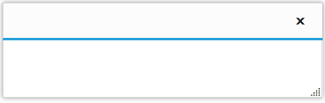
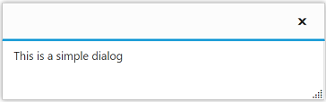
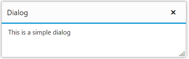
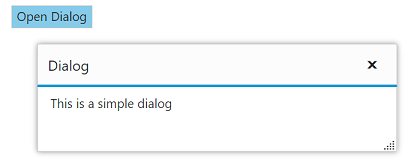

# Getting Started

This section helps to get started of the Dialog control in a PHP application.

## Create a Dialog

The following steps guide you to add a Dialog control.

Refer the common PHP Getting Started Documentation to create a PHP application and add necessary scripts and styles for rendering Essential PHP controls.

Create a simple Dialog object by referring the below code,**EJ\Dialog** object is created by using ‘new’ keyword. Define its properties and use **render()** method for rendering the control. We need to call the rendering element in echo statement. 


        <?php
        $dialog = new  \EJ\Dialog("dialog");           
            echo $dialog->render();
        ?>



This will render an empty Dialog control on executing.

## Add dialog content

You can add the content to Dialog Control. Here templateStart() is used to add content in the Dialog and templateEnd() is act as closing method of templateStart. The content given in between these will be taken as dialog content. Refer the below code for adding content in dialog control. 



    <?php
        $dialog = new  \EJ\Dialog("dialog");
        $dialog->templateStart();
        ?>
            

            <!--dialog content-->
                
This is a simple dialog

            

        <?php    
        
        echo $dialog->templateEnd()->render();
        ?>



Run the above code and output renders as follows,

## Set the title

You can set Dialog control title as follows.



    <?php
        $dialog = new  \EJ\Dialog("dialog");
        $dialog->title("Dialog")->templateStart();
        ?>
            

            <!--dialog content-->
                
This is a simple dialog

            

        <?php    
        
        echo $dialog->templateEnd()->render();

        ?>



Run the above code and your output will be,

## Open Dialog dynamically

In most cases, the Dialog control are needed only in dynamic actions like showing some messages on clicking a button, to provide alert, etc. So the Dialog control provides “open” and “close” methods to open/close the dialogs dynamically.
The Dialog control can be hidden on initialize using **showOnInit(false)** property which should be set to false. If you want to use **showOnInit** property you need to use as like this $dialog->title("Dialog")-> showOnInit(false)->templateStart();

Use the below code in the `php` tag. The dialog will be opened on clicking the Button control.



    <?php
        $dialog = new  \EJ\Dialog("dialog");
        $dialog->title("Dialog")->templateStart();
        ?>
            

            <!--dialog content-->
                
This is a simple dialog

            

        <?php    
        
        echo $dialog-> close("onDialogClose")->templateEnd()->render();
    $button = new \EJ\Button("button");
            echo $button->text("Click to open dialog")->type("button")->height("30px")->width("150px")->click("onButtonClick")->render();
        ?>



Add the following in the script section.



        function onDialogClose() {
            $("#button").show()
        }
        function onButtonClick() {
                $("#dialog").ejDialog("open");
        }



Run the above code, you get the output as below,

> _Note:_ _You can find the Dialog properties from the_ [API reference](https://help.syncfusion.com/api/js/ejdialog) _document_
