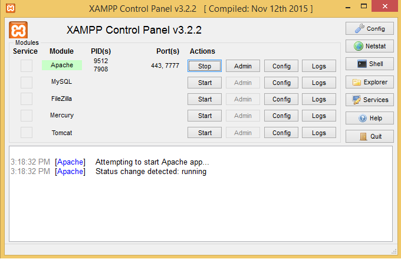
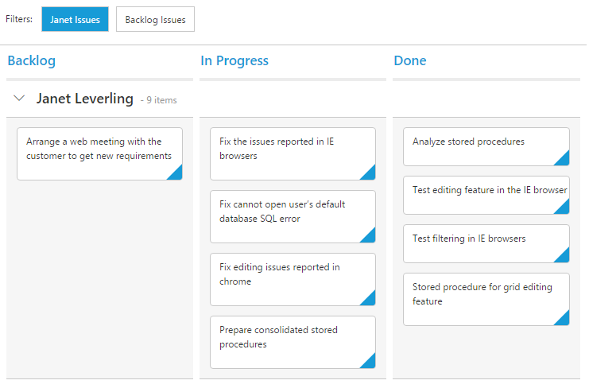

# Getting Started

To get start with the Kanban control using PHP wrapper classes, either of the following prerequisites needs to be installed in your machine to deploy and run those samples locally.

* [PHP tools for Visual Studio](https://visualstudiogallery.msdn.microsoft.com/6eb51f05-ef01-4513-ac83-4c5f50c95fb5)
* [Xampp](https://www.apachefriends.org/download.html)

In this section, let's see how to create, deploy and run the Kanban samples using Xampp server.

## Creating a Sample Folder 

Usually, the Xampp gets installed in **C:\\** drive. Now, create a new sample folder namely **KanbanPHP** within `C:\\xampp\\htdocs` and place all the below mentioned folders within it.   

* Scripts - Includes all the script files necessary to render the control. [Optional, if cdn links are used in the sample]
* CSS - Includes all the required stylesheet files. [Optional, if cdn links are used in the sample] 
* PHP Class Libraries - Includes the individual PHP wrapper class files for all the controls. [Mandatory] 
* Sample PHP file (with .php extension). [Mandatory]

### Adding Scripts and CSS files

The required scripts and CSS files can be copied into the above created sample folder namely **KanbanPHP** and then can be manually referred on the sample page or else the cdn links can be referred directly. In case, if you are manually referring the scripts and CSS files in your PHP sample, refer this [topic](https://help.syncfusion.com/js/control-initialization#manual-reference-of-scripts-and-style-sheets-in-a-html-page) to know how to copy the required scripts and CSS from the installed location.  

### Adding PHP Class libraries

Copy the PHP class libraries into your sample folder, which are the collection of PHP wrapper files created individually for all the controls in order to access and process its server-side values and then send it back to the client-side. These libraries are available within the following installed location - 

* **(Installed Location)\\Syncfusion\\Essential Studio\\{{ site.releaseversion }}\\PHP\\Src** 

## Create a PHP file

Create a first PHP file in Xampp and name it appropriately with `.php` extension and also place it under the newly created sample folder **KanbanPHP**. For example, say Index.php with the initial code as shown below -



    <!DOCTYPE html>
    <html>
        <head>
            <title>Getting Started - Kanban</title>
            <!--Dependency files references-->
        </head>
        <body>
            <?php
            ?>
        </body>
    </html>



## Scripts and CSS references

Refer the required scripts and CSS files in your PHP page as mentioned below in order to render the Kanban control - 



    <!DOCTYPE html>
    <html>
        <head>
                <title>Getting Started - Kanban</title>
                <link href="http://cdn.syncfusion.com/{{ site.releaseversion }}/js/web/flat-azure/ej.web.all.min.css" rel="stylesheet" />
                <link href="http://cdn.syncfusion.com/{{ site.releaseversion }}/js/web/responsive-css/ej.responsive.css" rel="stylesheet" />
                
                
                
        </head>
        <body>
            <?php
            ?>
        </body>
    </html>



Here, the CDN links are used. In case, if the individual scripts are required to render the Kanban control, refer [here](/php/kanban/dependencies).

## AutoLoad file reference

Include the PHP AutoLoad file reference within the `body` section of the PHP page.



    <!DOCTYPE html>
    <html>
        <head>
                <title>Getting Started - Kanban</title>
                <link href="http://cdn.syncfusion.com/{{ site.releaseversion }}/js/web/flat-azure/ej.web.all.min.css" rel="stylesheet" />
                <link href="http://cdn.syncfusion.com/{{ site.releaseversion }}/js/web/responsive-css/ej.responsive.css" rel="stylesheet" />
                
                
                
        </head>
        <body>
            <?php require_once 'EJ\AutoLoad.php'; ?>
        </body>
    </html>

 

## Create a Kanban

Create the Kanban control object by accessing the Kanban namespace `EJ\\Kanban` using `new` keyword. Define its properties and then output the Kanban control by echoing the result object.



        <body>         
            <?php 
                require_once 'EJ\AutoLoad.php';
                $kanban = new EJ\Kanban("defaultKanban");    
                $column = new EJ\Kanban\Column();
                $column ->headerText("Backlog");    
                $column1 = new EJ\Kanban\Column();
                $column1 ->headerText("In Progress");    
                $column2 = new EJ\Kanban\Column();
                $column2 ->headerText("Done");  
                $columns = array( 
                $column,$column1,$column2
                );    
                echo $kanban ->columns($columns)->render();
            ?>
        </body>



N> 2.It is mandatory to define the render() method at last as given in the above syntax, in order to display the Kanban on the browser.

## Data Binding

`Data binding` in the Kanban is achieved by using the [ej.DataManager](http://help.syncfusion.com/js/datamanager/overview) that supports both RESTful JSON data services binding and local JSON array binding. To set the data source to Kanban, the `dataSource` property is assigned with the instance of the `ej.DataManger`. 

For demonstration purpose, [Northwind OData service](http://mvc.syncfusion.com/Services/Northwnd.svc/) is used in this tutorial. Refer to the following code example.



        <body>
            <?php 
                require_once 'EJ\AutoLoad.php';
                $dataManager= new EJ\DataManager();
                $dataManager->url('http://mvc.syncfusion.com/Services/Northwnd.svc/Tasks')->offline(false);
                $kanban = new EJ\Kanban("defaultKanban");    
                $column = new EJ\Kanban\Column();
                $column ->headerText("Backlog");    
                $column1 = new EJ\Kanban\Column();
                $column1 ->headerText("In Progress");    
                $column2 = new EJ\Kanban\Column();
                $column2 ->headerText("Done");  
                $columns = array( 
                $column,$column1,$column2
                );    
                echo $kanban ->columns($columns)->dataSource($dataManager)->render();
            ?>
        </body>



N>  ODataAdaptor is the default adaptor used within DataManager. While binding to other web services, proper [data adaptor](http://help.syncfusion.com/js/datamanager/data-adaptors) needs to be set for `adaptor` option of DataManager.

## Mapping Values

In order to display cards in Kanban control, you need to map the database fields to Kanban cards and columns. The required mapping field are listed as follows

* `keyField` - Map the column name to use as `key` values to columns.
* `columns` -  Map the corresponding `key` values of `keyField` column to each columns
* `content` - Map the column name to use as content to cards within `Field` object.
* `primaryKey` - Map the column name to use as primary Key within `Field` object.



        <body>
            <?php 
                require_once 'EJ\AutoLoad.php';
                $dataManager= new EJ\DataManager();
                $dataManager->url('http://mvc.syncfusion.com/Services/Northwnd.svc/Tasks')->offline(false);
                $kanban = new EJ\Kanban("defaultKanban");    
                $column = new EJ\Kanban\Column();
                $column ->key("Open")->headerText("Backlog");    
                $column1 = new EJ\Kanban\Column();
                $column1 ->key("InProgress")->headerText("In Progress"); 
                $column2 = new EJ\Kanban\Column();
                $column2 ->key("Close")->headerText("Done");      
                $fields = new EJ\Kanban\Field();
                $fields ->content("Summary")->primaryKey("Id");
                $columns = array( 
                $column,$column1,$column2
                );    
                echo $kanban ->columns($columns)->dataSource($dataManager)->fields($fields)->keyField("Status")->render();
            ?>
        </body>

 

N>  `primaryKey` field is mandatory for “Drag and Drop” ,”Selection” and “Editing” Features.

## Enable Swimlane

`Swimlane` can be enabled by mapping the `swimlaneKey` of `Field` object to appropriate column name in `dataSource`. This enables the grouping of the cards based on the mapped column values.



        <body>
            <?php 
                require_once 'EJ\AutoLoad.php';
                $dataManager= new EJ\DataManager();
                $dataManager->url('http://mvc.syncfusion.com/Services/Northwnd.svc/Tasks')->offline(false);
                $kanban = new EJ\Kanban("defaultKanban");    
                $column = new EJ\Kanban\Column();
                $column ->key("Open")->headerText("Backlog");    
                $column1 = new EJ\Kanban\Column();
                $column1 ->key("InProgress")->headerText("In Progress"); 
                $column2 = new EJ\Kanban\Column();
                $column2 ->key("Close")->headerText("Done");      
                $fields = new EJ\Kanban\Field();
                $fields ->content("Summary")->primaryKey("Id")->swimlaneKey("Assignee");
                $columns = array( 
                $column,$column1,$column2
                );    
                echo $kanban ->columns($columns)->dataSource($dataManager)->fields($fields)->keyField("Status")->render();
            ?>
     </body>

 

## Adding Filters

Filters allows to filter the collection of cards from `dataSource` which meets the predefined `query` in the filters collection. To enable filtering, define `filterSettings` collection with display `text` and [ej.Query](http://help.syncfusion.com/js/datamanager/query).
 

        
        <body>
                <?php 
                require_once 'EJ\AutoLoad.php';
                $dataManager= new EJ\DataManager();
                $dataManager->url('http://mvc.syncfusion.com/Services/Northwnd.svc/Tasks')->offline(false);
                $kanban = new EJ\Kanban("defaultKanban");    
                $column = new EJ\Kanban\Column();
                $column ->key("Open")->headerText("Backlog");    
                $column1 = new EJ\Kanban\Column();
                $column1 ->key("InProgress")->headerText("In Progress"); 
                $column2 = new EJ\Kanban\Column();
                $column2 ->key("Close")->headerText("Done");      
                $fields = new EJ\Kanban\Field();
                $fields ->content("Summary")->primaryKey("Id")->swimlaneKey("Assignee");
                $columns = array( 
                $column,$column1,$column2
                );    
                $filterQuery = new EJ\Query();
                $filterQuery->where("'Assignee','equal','Janet Leverling'");
                $filterQuery1 = new EJ\Query();
                $filterQuery1->where("'Status','equal','Open'");
                $filter = new EJ\Kanban\FilterSetting();
                $filter->text("Janet Issues")->query($filterQuery)->description("Displays issues which matches the assignee as Janet Leverling");
                $filter1 = new EJ\Kanban\FilterSetting();
                $filter1->text("Backlog Issues")->query($filterQuery1)->description("Display the issues of 'Backlog'");
                echo $kanban ->columns($columns)->dataSource($dataManager)->fields($fields)->filterSettings(array($filter,$filter1))->keyField("Status")->render();
            ?>
            </body>

 

## Running the PHP file

The above created sample is now ready to run. Therefore, open the **XAMPP control panel** and start the **Apache** module as shown in the below image - 

Now, the sample can be run directly on the browser through localhost with appropriate port numbers, on which the Apache server is currently listening. For example, say if the Apache is configured to listen on port 7777, then type http://localhost:7777/ on your browser and press enter. Also, make sure that your sample folder is present within this location `C:\\xampp\\htdocs` as mentioned earlier.

The following Kanban output shows up on the browser, when you type http://localhost:7777/KanbanPHP/index.php and press enter - 

N> In case, if you face any problem with default port 80 while running your sample, make the Apache to listen on some other different ports. The port number changes needs to be done on both the `httpd.conf` and `httpd-ssl.conf` files, in order to get rid of this problem.(Refer [here](http://stackoverflow.com/questions/20558410/xampp-port-80-in-use-by-unable-to-open-process-with-pid-4-12)) 
