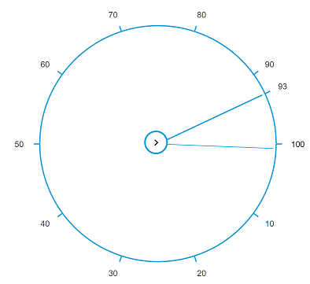

# Getting Started

 This section helps to get started of the RadialSlider control in a PHP application.

## Create a RadialSlider

The following steps guide you to add a RadialSlider control.

Refer the common PHP Getting Started Documentation to create a PHP application and add necessary scripts and styles for rendering Essential PHP controls.

Create a simple RadialSlider object by referring the below code, **EJ\RadialSlider** object is created by using ‘new’ keyword. Define its properties and use **render()** method for rendering the control. We need to call the rendering element in echo statement.



    <?php
    $radialslider=new EJ\RadialSlider("defaults");
    echo $radialslider->render();
    ?>



## Image Configuration

InnerCircleImageUrl is used to render image from given URL in RadialSlider control.



    <?php
    $radialslider=new EJ\RadialSlider("defaults");
    echo $radialslider->innerCircleImageUrl("content/images/radialslider/chevron-right.png")->render();
    ?>



> _Note:_ _You can find the RadialSlider properties from the_ [API reference](https://help.syncfusion.com/api/js/ejradialslider) _document_
