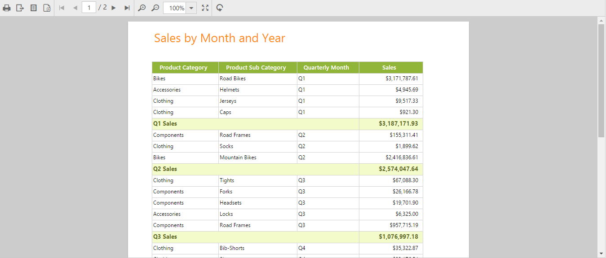
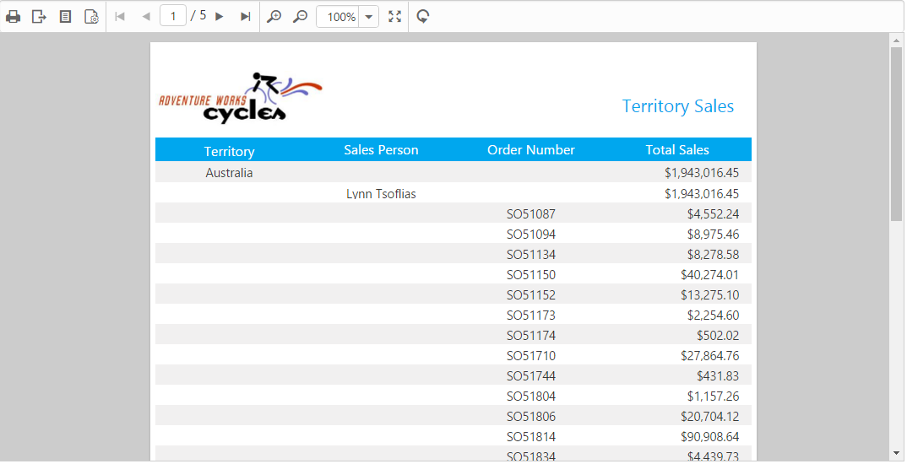
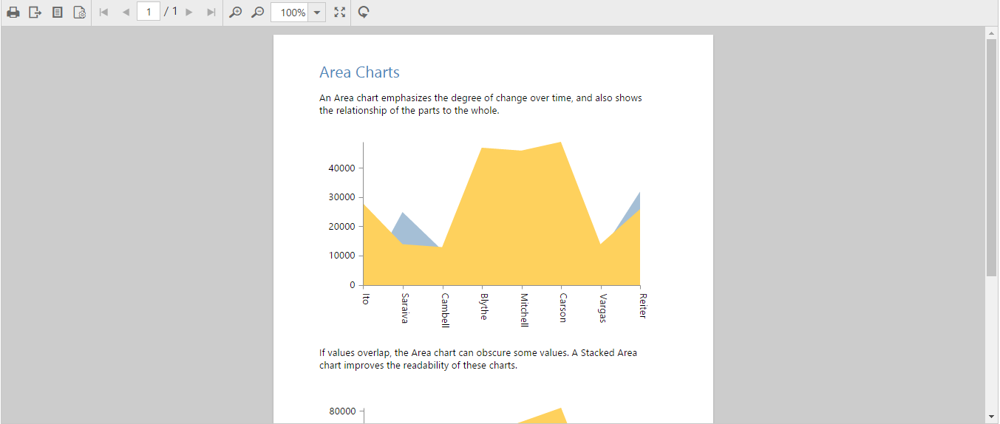

# Getting Started

To get start with the ReportViewer control by using PHP wrapper classes, any one of the following prerequisites need to be installed in your machine to deploy, and run those samples locally.

* [PHP tools for Visual Studio](https://visualstudiogallery.msdn.microsoft.com/6eb51f05-ef01-4513-ac83-4c5f50c95fb5)
* [Xampp](https://www.apachefriends.org/download.html)

In this section, you can see how to create, deploy, and run the ReportViewer samples using the Xampp server.

## Creating a sample folder 

Usually, the Xampp gets installed in **C:\\** drive. Now, create a new sample folder namely **ReportViewerTutorial** within `C:\\xampp\\htdocs` and place all the below mentioned folders within it.

* Scripts - Includes all the script files necessary to render the control. [Optional, if cdn links are used in the sample]
* CSS - Includes all the required stylesheet files. [Optional, if cdn links are used in the sample] 
* PHP class libraries - Includes the individual PHP wrapper class files for all controls. [Mandatory]
* Sample PHP file (with .php extension). [Mandatory]

### Adding scripts and CSS files

The required scripts and CSS files can be copied into the above created sample folder namely **ReportViewerTutorial** and can be manually referred on the sample page or else the cdn links can be referred directly. In case, if you are manually referring the scripts and CSS files in the PHP sample, refer this [topic](https://help.syncfusion.com/js/control-initialization#manual-reference-of-scripts-and-style-sheets-in-a-html-page) to know how to copy the required scripts and CSS files from the installed location.  

### Adding PHP class libraries

Copy the PHP class libraries into the sample folder, which are the collection of PHP wrapper files. The PHP wrapper files are created individually for all controls to access and process its server-side values and then send it back to the client-side. These libraries are available within the following installed location:

* **(Installed Location)\\Syncfusion\\Essential Studio\\{{ site.releaseversion }}\\PHP\\Src** 

## Create a PHP file

Create a first PHP file in Xampp and name it appropriately with `.php` extension and also place it under the newly created sample folder **ReportViewerTutorial**. For example, say Index.php with the initial code as shown below:



    <!DOCTYPE html>
    <html>
        <head>
            <title>Getting Started - ReportViewer</title>
            <!--Dependency files references-->
        </head>
        <body>
            <?php
            ?>
        </body>
    </html>



## Scripts and CSS references

Refer the required scripts and CSS files in the PHP page as mentioned below to render the ReportViewer control:



    <!DOCTYPE html>
    <html>
        <head>
                <title>Getting Started - ReportViewer</title>
                <link href="http://cdn.syncfusion.com/{{ site.releaseversion }}/js/web/flat-azure/ej.web.all.min.css" rel="stylesheet" />
                <link href="http://cdn.syncfusion.com/{{ site.releaseversion }}/js/web/responsive-css/ej.responsive.css" rel="stylesheet" />
                
                
                
        </head>
        <body>
            <?php
            ?>
        </body>
    </html>



## AutoLoad file reference

Include the PHP AutoLoad file reference within the `body` section of the PHP page.



    <!DOCTYPE html>
    <html>
        <head>
                <title>Getting Started - ReportViewer</title>
                <link href="http://cdn.syncfusion.com/{{ site.releaseversion }}/js/web/flat-azure/ej.web.all.min.css" rel="stylesheet" />
                <link href="http://cdn.syncfusion.com/{{ site.releaseversion }}/js/web/responsive-css/ej.responsive.css" rel="stylesheet" />
                
                
                
        </head>
        <body>
            <?php require_once 'EJ\AutoLoad.php'; ?>
        </body>
    </html>

 

## Control initialization

Create the ReportViewer control object by accessing the ReportViewer namespace `EJ\\ReportViewer` using the `new` keyword. Define its properties and then output the ReportViewer control by echoing the result object.



<body>
<?php
    require_once 'EJ\AutoLoad.php';
    $ReportViewer = new EJ\ReportViewer("defaultReportViewer");
    echo $ReportViewer  -> width("100%") ->render();
?>
</body>



N> It is mandatory to define the render() method at last as given in the above syntax, to display the ReportViewer on the browser.

## Load RDL reports

Add necessary HTML elements and CSS style to render the ReportViewer and set the desired `ReportPath`, `ProcessingMode`, and `ReportServiceUrl` to the ReportViewer. The code example for defining the ReportViewer control in PHP is as follows:



<?php
require_once '../EJ/AutoLoad.php';
?>
<body>
    

        <?php
        $reportviewer = new EJ\ReportViewer('groupingaggregate_reportViewer');		
        echo $reportviewer->reportServiceUrl("http://js.syncfusion.com/ejservices/api/ReportViewer" )->processingMode("Remote")->reportPath("GroupingAgg.rdl")->render();
        ?>
    

    
</body>



## Running the PHP file

The above created sample is now ready to run. Therefore, open the **XAMPP control panel** and start the **Apache** module as shown in the below image: 

Now, the sample can be run directly on the browser through localhost with appropriate port numbers, on which the Apache server is currently listening. For example, if the Apache is configured to listen the port 8080, then type http://localhost:8080/ on the browser and press enter. Also, make sure that the sample folder is present within this location `C:\\xampp\\htdocs` as mentioned earlier.

The following ReportViewer output will be shown on the browser, when you type http://localhost:8080/ReportViewerTutorial/index.php and press enter. 

ReportViewer with Grouping Aggregate Report
{:.caption}.

N> In case, if you face any problem with default port 80 while running your sample, make the Apache to listen on some other different ports. The port number changes need to be done on both the `httpd.conf` and `httpd-ssl.conf` files, to get rid of this problem.(Refer [here](http://stackoverflow.com/questions/20558410/xampp-port-80-in-use-by-unable-to-open-process-with-pid-4-12)).

## Load SSRS server reports

Add necessary HTML elements and CSS style to render ReportViewer and set the desired `ReportPath`, `ProcessingMode`, and `ReportServiceUrl` to the ReportViewer. The code example for defining the ReportViewer control in PHP is as follows:



<?php
require_once '../EJ/AutoLoad.php';
?>
<body>
    

        <?php
         $reportviewer = new EJ\ReportViewer('territorysales_reportViewer');		
        echo $reportviewer->reportServiceUrl("http://js.syncfusion.com/ejservices/api/ReportViewer" )->processingMode("Remote")->reportServerUrl("http://mvc.syncfusion.com/reportserver")->reportPath("/SSRSSamples2/Territory Sales new")->render();
        ?>
    

    
</body>



## Running the PHP file

The above created sample is now ready to run. Therefore, open the **XAMPP control panel** and start the **Apache** module as shown in the below image: 

Now, the sample can be run directly on the browser through localhost with appropriate port numbers, on which the Apache server is currently listening. For example, if the Apache is configured to listen the port 8080, then type http://localhost:8080/ on the browser and press enter. Also, make sure that the sample folder is present within this location `C:\\xampp\\htdocs` as mentioned earlier.

The following ReportViewer output will be shown on the browser, when you type http://localhost:8080/ReportViewerTutorial/index.php and press enter.

Report from SSRS
{:.caption}

N> In case, if you face any problem with default port 80 while running the sample, make the Apache to listen some other different ports. The port number changes need to be done on both the `httpd.conf` and `httpd-ssl.conf` files, to get rid of this problem.(Refer [here](http://stackoverflow.com/questions/20558410/xampp-port-80-in-use-by-unable-to-open-process-with-pid-4-12)).

## Load RDLC reports

The ReportViewer has data binding support to visualize the RDLC reports and set the desired `reportPath`, `reportServerUrl`, `processingMode`, and `reportServiceUrl` to the ReportViewer. The following code example helps you to bind data to the ReportViewer.



<ej-reportviewer id="reportViewer_Control" [reportServiceUrl] = "serviceUrl" [processingMode] = "Local"	 [reportServerUrl] = "serverUrl" [reportPath] = "reportPath" [dataSources]="reportData" >
</ej-reportviewer>





ej-reportviewer {
    display: block;
    height: 550px;
}





import { Component } from '@php';

@Component({
    selector: 'ej-app',
    templateUrl: 'src/reportviewer/reportviewer.component.html',
	styleUrls: ['src/reportviewer/reportviewer.component.css']
})

export class ReportViewerComponent {
    public serviceUrl: string;    
    public reportPath: string;
	public reportData: any;

    constructor() {
        this.serviceUrl = 'http://js.syncfusion.com/ejservices/api/ReportViewer';        
        this.reportPath = 'AreaCharts.rdlc"';
		this.reportData = [{
      value: [
        { SalesPersonID: 281, FullName: 'Ito', Title: 'Sales Representative', SalesTerritory: 'South West', Y2002: 0, Y2003: 28000, Y2004: 3018725 },
        { SalesPersonID: 282, FullName: 'Saraiva', Title: 'Sales Representative', SalesTerritory: 'Canada', Y2002: 25000, Y2003: 14000, Y2004: 3189356 },
        { SalesPersonID: 283, FullName: 'Cambell', Title: 'Sales Representative', SalesTerritory: 'North West', Y2002: 12000, Y2003: 13000, Y2004: 1930885 },
        { SalesPersonID: 275, FullName: 'Blythe', Title: 'Sales Representative', SalesTerritory: 'North East', Y2002: 19000, Y2003: 47000, Y2004: 4557045 },
        { SalesPersonID: 276, FullName: 'Mitchell', Title: 'Sales Representative', SalesTerritory: 'South West', Y2002: 28000, Y2003: 46000, Y2004: 5240075 },
        { SalesPersonID: 277, FullName: 'Carson', Title: 'Sales Representative', SalesTerritory: 'Central', Y2002: 33000, Y2003: 49000, Y2004: 3857163 },
        { SalesPersonID: 278, FullName: 'Vargas', Title: 'Sales Representative', SalesTerritory: 'Canada', Y2002: 11000, Y2003: 14000, Y2004: 1764938 },
        { SalesPersonID: 279, FullName: 'Reiter', Title: 'Sales Representative', SalesTerritory: 'South East', Y2002: 32000, Y2003: 26000, Y2004: 2811012 }
      ],
      name: 'AdventureWorksXMLDataSet'
    }];
    }
}



N> Default RDLC report will be rendered, which is used in the online service.

## Running the PHP file

The above created sample is now ready to run. Therefore, open the **XAMPP control panel** and start the **Apache** module as shown in the below image:

Now, the sample can be run directly on the browser through localhost with appropriate port numbers, on which the Apache server is currently listening. For example, if the Apache is configured to listen on the port 8080, then type http://localhost:8080/ on the browser and press enter. Also, make sure that the sample folder is present within this location `C:\\xampp\\htdocs` as mentioned earlier.

The following ReportViewer output will be shown on the browser, when you type http://localhost:8080/ReportViewerTutorial/index.php and press enter.

Area chart RDLC report
{:.caption}

N> In case, if you face any problem with the default port 80 while running the sample, make the Apache to listen some other different ports. The port number changes need to be done on both the `httpd.conf` and `httpd-ssl.conf` files,  to get rid of this problem.(Refer [here](http://stackoverflow.com/questions/20558410/xampp-port-80-in-use-by-unable-to-open-process-with-pid-4-12)).
