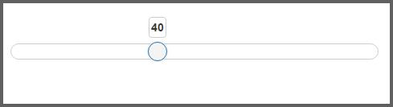

# Getting Started

This section explains briefly about how to create a **Slider** in your application with **PHP** wrapper classes of EJ controls.	

## Create your first Slider in PHP

**EJ PHP Slider** widget allows you to switch between different ranges of input. The basic **Slider** is in horizontal position and has a single handle that is moved by the mouse or the arrow keys.

Create a PHP Project and add necessary scripts and styles with the help of the given PHP Getting Started Documentation.

You can render the PHP Slider control as show below.

    

        <?php
        $slider = new \EJ\Slider('slider');
        echo $slider->value(40)->render();
        ?>

    

The following screenshot displays the final output in Slider creation.

